# ビジネスルール関係図（Mermaid）

このドキュメントはstella-crmのテーブル間・機能間の影響関係をMermaid図で整理したものです。

**最終更新日**: 2026-02-07

**凡例**:
- 実線矢印（`-->`, `==>`)：FK / onDelete: Cascade
- 破線矢印（`-.->`)：コード上のビジネスロジック（自動更新・計算連動等）
- 太線矢印（`==>`)：特にリスクの高いカスケード連鎖

---

## 目次

1. [全体俯瞰図](#1-全体俯瞰図)
2. [Stella企業 カスケード削除チェーン](#2-stella企業-カスケード削除チェーン)
3. [STP企業 カスケード削除チェーン](#3-stp企業-カスケード削除チェーン)
4. [代理店 カスケード削除チェーン](#4-代理店-カスケード削除チェーン)
5. [ステージ管理フロー](#5-ステージ管理フロー)
6. [財務自動生成フロー](#6-財務自動生成フロー)
7. [請求書・消込フロー](#7-請求書消込フロー)
8. [月次締めフロー](#8-月次締めフロー)
9. [外部ユーザー登録フロー](#9-外部ユーザー登録フロー)
10. [リード獲得フォームフロー](#10-リード獲得フォームフロー)
11. [会計システムフロー](#11-会計システムフロー)
12. [認証・権限フロー](#12-認証権限フロー)

---

## 1. 全体俯瞰図

```mermaid
graph TB
    subgraph "Stella 全顧客マスタ"
        MSC[MasterStellaCompany]
        SCL[StellaCompanyLocation]
        SCC[StellaCompanyContact]
        SCBA[StellaCompanyBankAccount]
    end

    subgraph "STP プロジェクト"
        SC[StpCompany]
        SS[StpStage]
        SSH[StpStageHistory]
        SCH[StpContractHistory]
        SCCON[StpCompanyContract]
        CAND[StpCandidate]
        PROP[StpProposal]
        KPI[StpKpiSheet]
    end

    subgraph "代理店"
        SA[StpAgent]
        SAC[StpAgentContract]
        SACH[StpAgentContractHistory]
        SACO[StpAgentCommissionOverride]
        LFT[StpLeadFormToken]
        LFS[StpLeadFormSubmission]
    end

    subgraph "財務"
        SRR[StpRevenueRecord]
        SER[StpExpenseRecord]
        INV[StpInvoice]
        INVLI[StpInvoiceLineItem]
        PT[StpPaymentTransaction]
        PA[StpPaymentAllocation]
        MC[StpMonthlyClose]
        FEL[StpFinanceEditLog]
    end

    subgraph "会計（横断）"
        AIB[AccountingImportBatch]
        AT[AccountingTransaction]
        AR[AccountingReconciliation]
        AV[AccountingVerification]
        AMC[AccountingMonthlyClose]
    end

    subgraph "認証・外部ユーザー"
        MS[MasterStaff]
        EU[ExternalUser]
        DV[DisplayView]
        RT[RegistrationToken]
    end

    subgraph "マスタ"
        MP[MasterProject]
        OC[OperatingCompany]
        MCS[MasterContractStatus]
        MCON[MasterContract]
    end

    MSC --> SCL
    MSC --> SCC
    MSC --> SCBA
    MSC --> SC
    MSC --> SCH
    MSC --> SA
    MSC --> MCON
    MSC --> EU
    MSC --> RT

    SC --> SSH
    SC --> SCCON
    SC --> CAND
    SC --> PROP
    SC --> KPI
    SC --> SRR
    SC --> SER
    SC --> SACO
    SC --> INV

    SA --> SAC
    SA --> SACH
    SA --> LFT
    SA --> SER
    SA --> INV

    SACH --> SACO
    SACH --> SER

    SCH --> SRR
    SCH --> SER

    SRR --> PA
    SER --> PA
    PT --> PA

    INV --> INVLI
    INV --> SRR
    INV --> SER

    AT --> AR
    AT --> AV
    AIB --> AT

    LFT --> LFS
    LFS --> PROP

    MP --> MCON
    MP --> AMC
    OC --> MP
```

---

## 2. Stella企業 カスケード削除チェーン

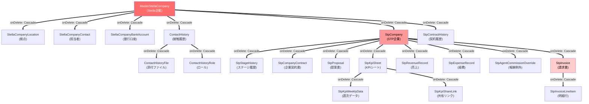

**危険度**: Stella企業を1件削除すると、STP企業→売上/経費/請求書/KPI→明細行/週次データまで全て連鎖削除される。

---

## 3. STP企業 カスケード削除チェーン

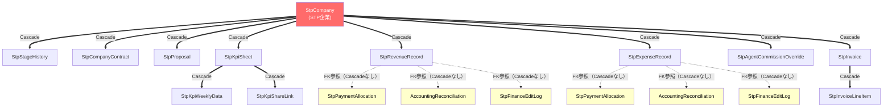

**注意**: 黄色ノードはCascade削除対象外。STP企業削除時にPaymentAllocation/AccountingReconciliation/FinanceEditLogは自動削除されず、FK制約エラーの可能性あり。

---

## 4. 代理店 カスケード削除チェーン

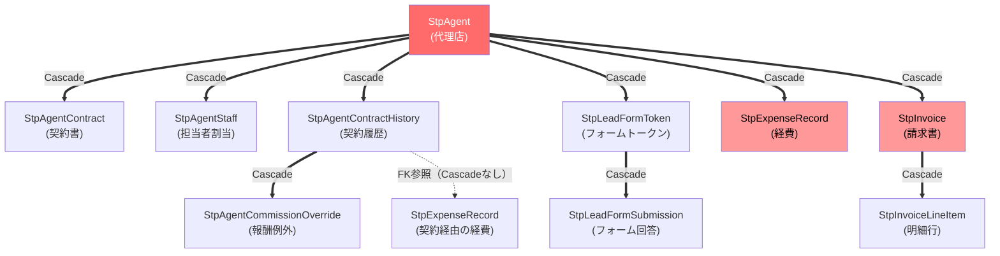

---

## 5. ステージ管理フロー

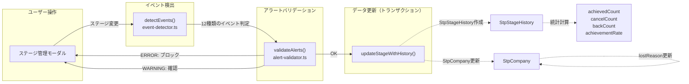

### イベントタイプ判定フロー

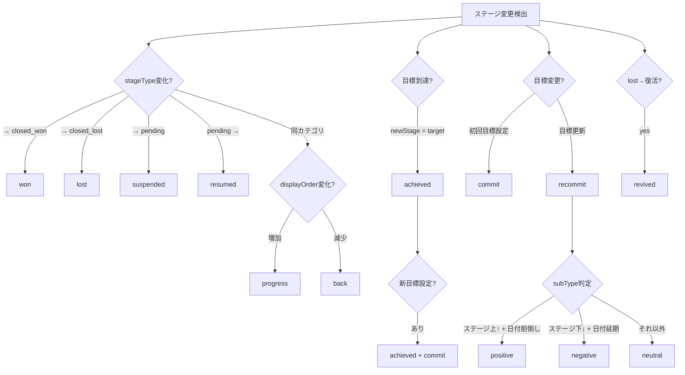

---

## 6. 財務自動生成フロー

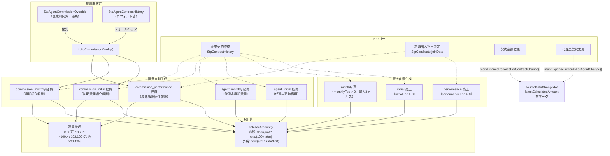

### 冪等性チェック

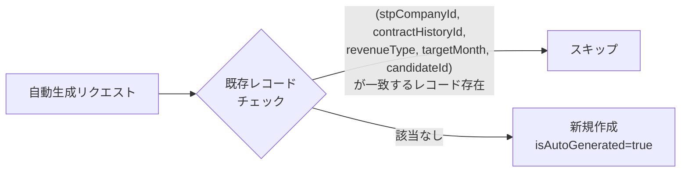

---

## 7. 請求書・消込フロー

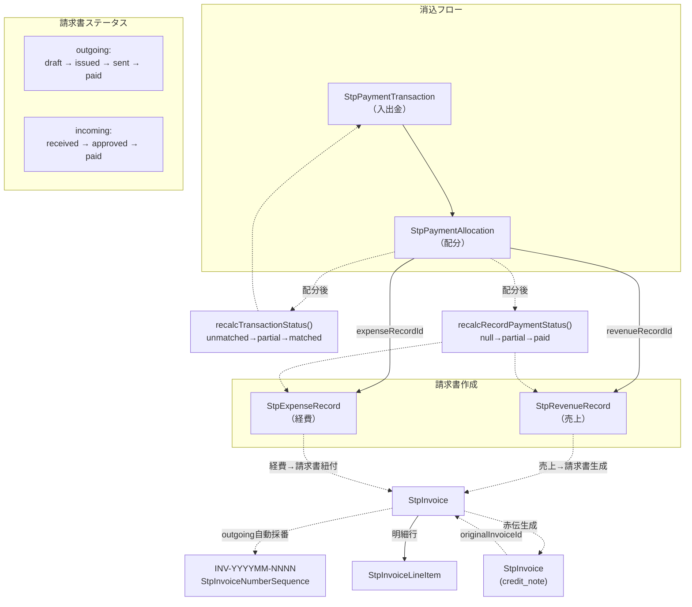

### 税率別集計（インボイス制度）

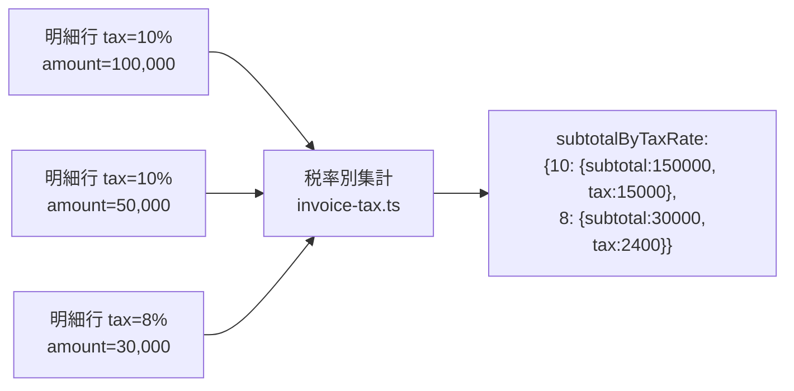

---

## 8. 月次締めフロー

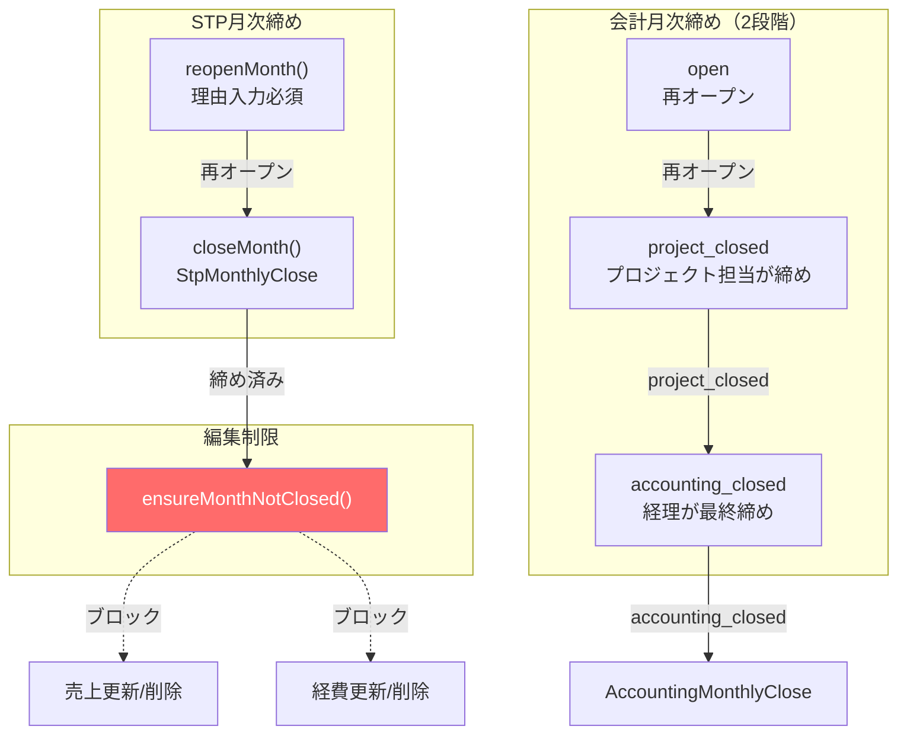

---

## 9. 外部ユーザー登録フロー

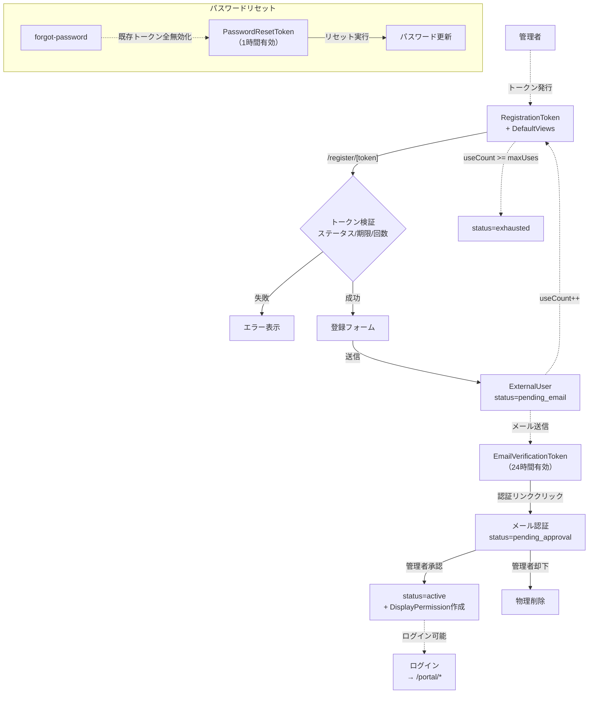

---

## 10. リード獲得フォームフロー

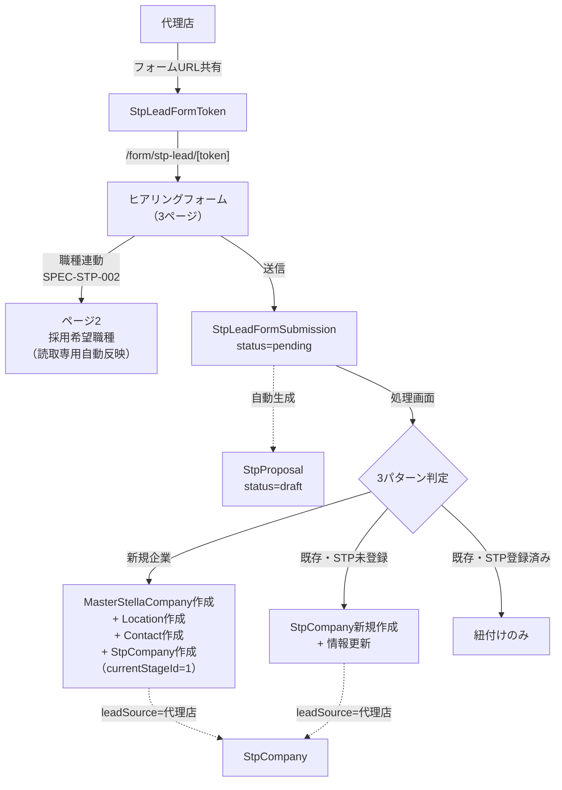

---

## 11. 会計システムフロー

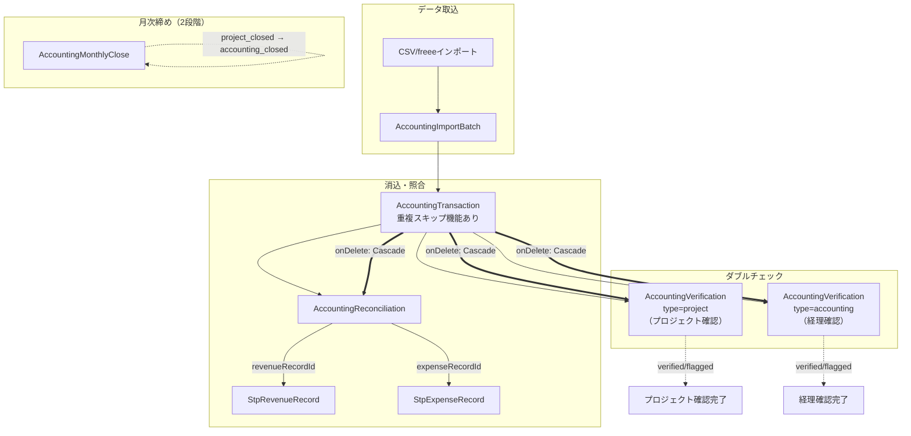

---

## 12. 認証・権限フロー

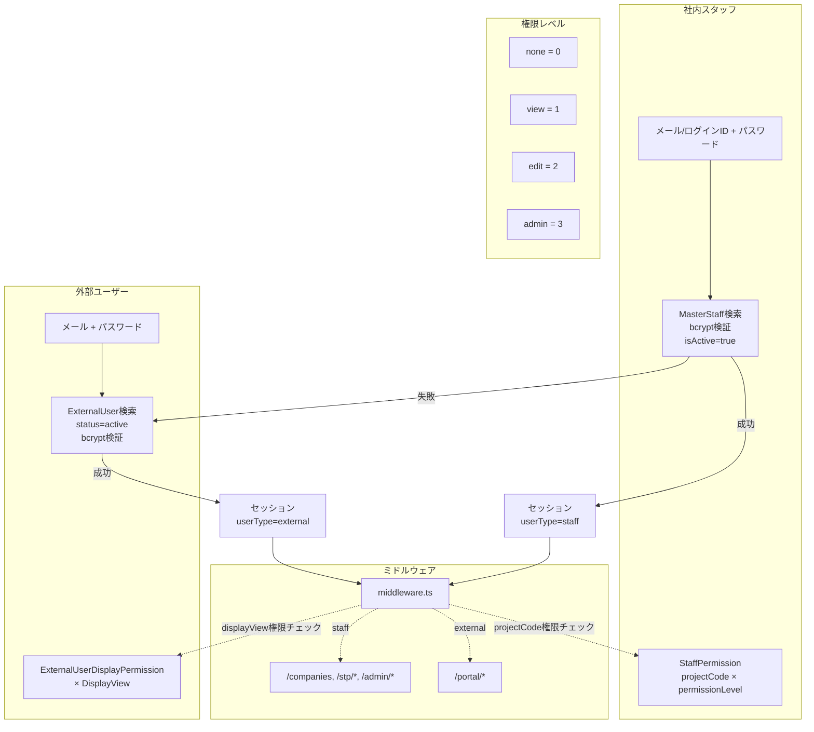

---

## テーブル数サマリー

| カテゴリ | テーブル数 | 主要テーブル |
|---------|-----------|-------------|
| 全顧客マスタ | 4 | MasterStellaCompany, Location, Contact, BankAccount |
| STPプロジェクト | 7 | StpCompany, StpStage, StpStageHistory, StpContractHistory, StpCompanyContract, StpCandidate, StpProposal |
| 代理店 | 6 | StpAgent, StpAgentContract, StpAgentStaff, StpAgentContractHistory, StpAgentCommissionOverride, StpLeadFormToken |
| 財務 | 8 | StpRevenueRecord, StpExpenseRecord, StpInvoice, StpInvoiceLineItem, StpPaymentTransaction, StpPaymentAllocation, StpMonthlyClose, StpFinanceEditLog |
| 会計 | 5 | AccountingImportBatch, AccountingTransaction, AccountingReconciliation, AccountingVerification, AccountingMonthlyClose |
| 認証・外部ユーザー | 8 | MasterStaff, ExternalUser, DisplayView, ExternalUserDisplayPermission, RegistrationToken, RegistrationTokenDefaultView, EmailVerificationToken, PasswordResetToken |
| マスタ | 6 | MasterProject, OperatingCompany, MasterContractStatus, MasterContract, MasterContractStatusHistory, ContactMethod |
| リード | 2 | StpLeadFormSubmission, StpProposal |
| KPI | 3 | StpKpiSheet, StpKpiWeeklyData, StpKpiShareLink |
| その他 | 5 | ContactHistory, ContactHistoryFile, ContactHistoryRole, CustomerType, ShortUrl, LoginHistory |
| **合計** | **約54** | |
