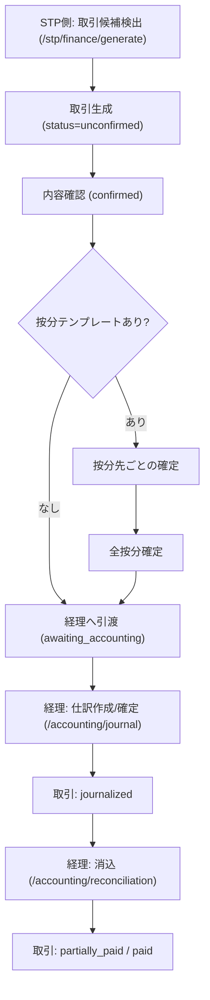

# SPEC-ACCOUNTING-001 補足: 採用ブースト側フロー（プロジェクト側起点）

## 1. 目的

`SPEC-ACCOUNTING-001-requirements.md` / `SPEC-ACCOUNTING-001-design.md` を元に実装した機能について、採用ブースト（STP）側の担当者目線で「どこから始まり、どの操作で、どの状態になり、どこで経理側に引き渡されるか」を説明する。

この文書は、仕様書の補足として「運用フロー」を読むためのもの。

## 2. 先に結論（経理に飛ぶタイミング）

- 取引ベースで経理に引き渡された状態は `Transaction.status = awaiting_accounting`（経理処理待ち）
- 経理ダッシュボードの「未仕訳取引」はこの状態の取引を起点に処理する
- 売上/経費のグループ（`InvoiceGroup` / `PaymentGroup`）は、請求・受領・支払の運用管理用のまとまり

つまり、「請求書を送った」だけでは経理処理開始の完了ではなく、最終的には取引が `awaiting_accounting` になることが経理側の受け口になる。

## 3. 主な画面（STP側と経理側の接続点）

### STP側（採用ブースト）

- `/stp/finance/overview` ダッシュボード（入口）
- `/stp/finance/generate` 取引候補の検出・生成
- `/stp/finance/transactions` 取引一覧（状態確認・検索）
- `/stp/finance/invoices` 請求グループ管理（売上）
- `/stp/finance/payment-groups` 支払グループ管理（経費）

### 経理側（引き渡し後の処理）

- `/accounting/dashboard` 経理ダッシュボード（未仕訳取引の入口）
- `/accounting/transactions` 取引確認・差し戻し・再提出・経理引渡し
- `/accounting/journal` 仕訳作成/確定
- `/accounting/reconciliation` 消込（入出金と仕訳の突合）

## 4. 全体フロー（共通）

補足:

- 売上はこの取引フローに加えて `請求グループ` の作成・PDF・送付がある
- 経費はこの取引フローに加えて `支払グループ` の作成・発行依頼・請求書受領確認がある

## 5. 売上フロー（採用ブースト側）

### 5.1 起点: 取引候補を検出して生成する

1. `/stp/finance/generate` で対象月を選ぶ
2. 「候補を検出」を押す
3. CRM契約 / 定期取引から候補が出る
4. 必要な候補にチェックして「選択したn件を生成」
5. `Transaction` が作成される（新規は `status=unconfirmed`）

実装ポイント:

- 既存取引がありソース変更がある候補は、新規作成ではなく更新になる場合がある
- 更新できるのは既存取引が `unconfirmed` / `confirmed` のとき

### 5.2 取引の確認と経理引渡し

1. 生成後の取引を確認する（`unconfirmed -> confirmed`）
2. 按分テンプレートありの場合は按分先の確定を進める
3. 条件が整ったら「経理へ引渡」で `awaiting_accounting`

補足（実装上の見え方）:

- 按分テンプレート付き取引は、作成者のプロジェクト分が作成時に自動確定される
- 未確定の他プロジェクト分には通知が飛び、各プロジェクトで按分確定を進める
- `confirmed` 状態で全按分先が確定すると、取引は自動で `awaiting_accounting` に遷移する
- `returned`（差し戻し）になった取引は修正後に `resubmitted`（再提出）
- `resubmitted` から再度 `awaiting_accounting` に引き渡す

## 6. 売上フロー（請求グループ/請求書）

### 6.1 請求グループ作成

1. `/stp/finance/invoices` で「新規作成」
2. 取引先を選ぶ
3. 対象は「売上」かつ `confirmed` かつ `invoiceGroupId = null` の取引のみ
4. 明細を選択して作成
5. `InvoiceGroup.status = draft`

### 6.2 PDF作成・送付

1. 請求グループ詳細で PDFプレビュー
2. 保存すると請求書番号採番 + PDF保存
3. `draft -> pdf_created`
4. 「送付」からメール送信 or 手動送付記録
5. `pdf_created -> sent`

### 6.3 経理側に渡る見方

- 請求グループ自体も `awaiting_accounting` へ進む運用を想定
- ただし、経理側の実処理開始判定として重要なのは、最終的に関連取引が `awaiting_accounting` になっていること

## 7. 経費フロー（採用ブースト側）

### 7.1 取引作成までは売上と同じ

起点は同じく `/stp/finance/generate`（手動登録は現状 `/accounting/transactions/new` 運用）で、経費取引も `unconfirmed -> confirmed -> awaiting_accounting` の流れで経理側に引き渡す。

### 7.2 支払グループ作成

1. `/stp/finance/payment-groups` で「新規作成」
2. 取引先を選ぶ
3. 対象は「経費」かつ `confirmed` かつ `paymentGroupId = null` の取引のみ
4. 対象月 / 支払予定日 / 指定PDF名を設定
5. `PaymentGroup.status = before_request`

### 7.3 請求書発行依頼から支払確認まで

1. `before_request` で「発行依頼メール送信」
2. メール送信成功で `before_request -> requested`
3. 相手から請求書受領後、「請求書受領を記録」で `requested -> invoice_received`
4. 内容確認して「確認する」で `invoice_received -> confirmed`
5. 不備がある場合は「却下して再依頼」で `invoice_received -> rejected`
6. 再依頼メール送信で `rejected -> re_requested`
7. 再受領後に再度 `invoice_received`
8. 支払完了時に `confirmed -> paid`

補足:

- `PaymentGroup` は請求書受領・支払依頼の運用管理
- 実際の会計処理（仕訳/消込）は経理側で行い、関連取引のステータスが進む

## 8. 差し戻しフロー（経理 -> 採用ブースト）

### 8.1 経理側で差し戻し

経理側 `/accounting/transactions` で、経理担当が以下を実行できる。

- `confirmed -> returned`
- `awaiting_accounting -> returned`

差し戻し時は理由種別 + コメントを必須で登録し、作成者へ通知される。

### 8.2 採用ブースト側の再対応

1. 差し戻し内容を確認
2. 取引内容を修正（`returned` は編集可）
3. 再提出（`returned -> resubmitted`）
4. 再度経理へ引渡し（`resubmitted -> awaiting_accounting`）

## 9. 操作早見表（何を押すとどうなるか）

| 画面 | 操作 | 主な結果 |
|---|---|---|
| `/stp/finance/generate` | 候補を検出 | 対象月の取引候補を一覧表示 |
| `/stp/finance/generate` | 選択した候補を生成 | `Transaction` 作成（新規は `unconfirmed`） |
| `/accounting/transactions` | 確認 | `unconfirmed -> confirmed` |
| `/accounting/transactions` | 経理へ引渡 | `confirmed/resubmitted -> awaiting_accounting` |
| `/stp/finance/invoices` | 請求グループ新規作成 | 売上取引を `InvoiceGroup` に紐づけ（`draft`） |
| 請求グループ詳細 | PDF保存 | 請求書番号採番 + `pdf_created` |
| 請求グループ詳細/送付モーダル | メール送信 or 手動記録 | `pdf_created -> sent` |
| `/stp/finance/payment-groups` | 支払グループ新規作成 | 経費取引を `PaymentGroup` に紐づけ（`before_request`） |
| 支払グループ詳細 | 発行依頼メール送信 | `before_request -> requested` |
| 支払グループ詳細 | 請求書受領を記録 | `requested/re_requested -> invoice_received` |
| 支払グループ詳細 | 確認する | `invoice_received -> confirmed` |
| 支払グループ詳細 | 却下して再依頼 | `invoice_received -> rejected` |
| `/accounting/journal` | 仕訳確定 | 関連取引 `awaiting_accounting -> journalized` |
| `/accounting/reconciliation` | 消込 | 関連取引 `journalized -> partially_paid/paid` |

## 10. 実装上の注意（現状）

- STPの `取引一覧`（`/stp/finance/transactions`）は主に閲覧・状態確認用
- 取引の「確認」「差し戻し」「再提出」「経理へ引渡」の操作UIは現状 `/accounting/transactions` 側に実装されている
- そのため、運用説明では「STP担当の業務フロー」と「実際の操作画面（STP側/経理側）」を分けて伝えると混乱しにくい
