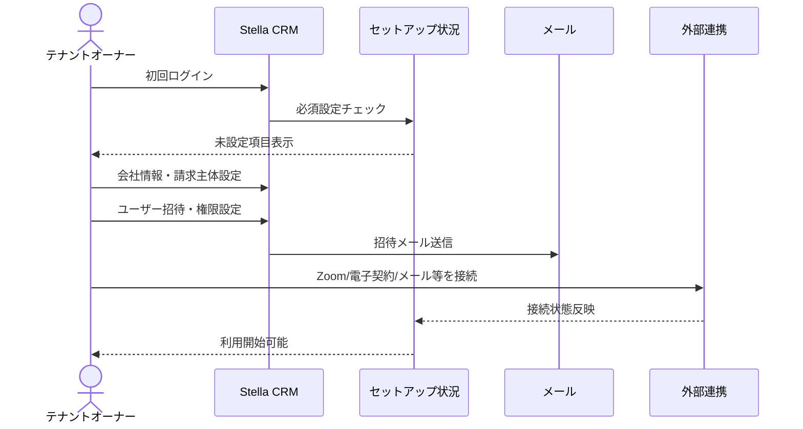
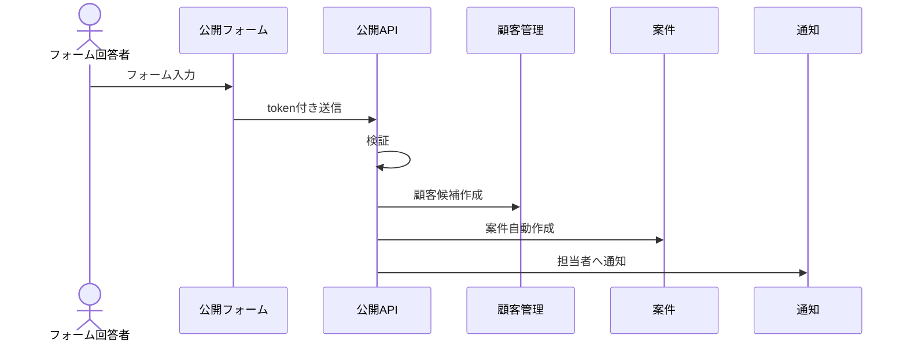
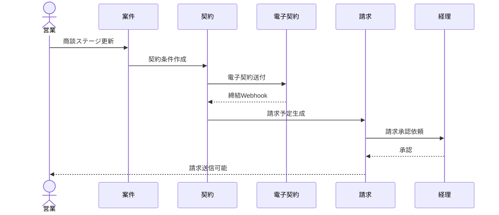
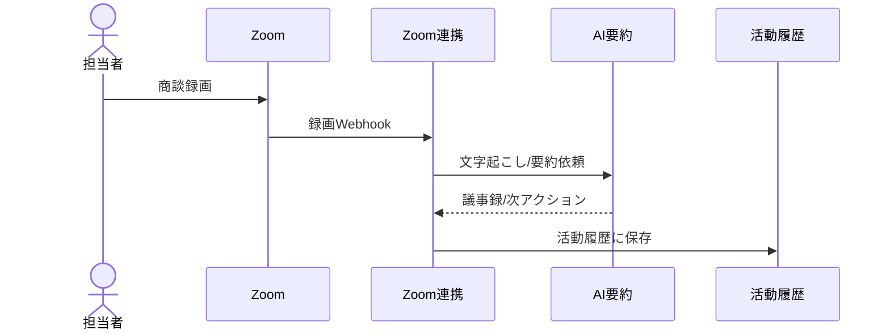

# Stella CRM 外販化 完全詳細仕様書

作成日: 2026-05-21

関連資料: `docs/stella-crm-commercialization-requirements.md`

## 1. 位置づけ

この文書は、Stella CRM を外販可能な業務システムへ再構築するための詳細仕様たたき台である。

上位資料 `stella-crm-commercialization-requirements.md` が「全体共有用の要約」であるのに対し、本書は以下を実装前に検討・分解するための詳細版として扱う。

- 画面別仕様
- DB / データ仕様
- API / Server Action仕様
- 権限仕様
- 外部連携仕様
- To-Be業務フロー
- 非機能要件
- 移行・開発優先度

注意: 本書は現行コード・現行ドキュメントを元にした詳細仕様案であり、最終確定仕様ではない。外販対象、販売先、初期販売プラン、法務/会計責任範囲が決まり次第、確定仕様に更新する。

## 2. 外販版の前提

### 2.1 基本方針

| 項目 | 方針 |
|------|------|
| 商品コンセプト | CRM、営業管理、契約、請求、議事録を統合した業務OS |
| 初期対象 | BtoB営業組織、採用支援会社、代理店ビジネスを持つ会社 |
| 初期スコープ | CRM Core + Sales Plus + Billing Basic + Meeting AI |
| 後続スコープ | Accounting Plus、Partner Portal、Customer Portal、業種テンプレート |
| 非対象 | 個社固有ProLine URL、USDT、セキュリティクラウド卸などの特殊運用 |

### 2.2 To-Beモジュール構成

| モジュール | 概要 | 初期搭載 |
|------------|------|----------|
| Tenant / Auth | テナント、ユーザー、権限、招待、ログイン | 必須 |
| CRM Core | 顧客、拠点、担当者、活動履歴、ファイル | 必須 |
| Sales Plus | 案件、商談パイプライン、契約、フォーム | 必須 |
| Billing Basic | 請求、取引台帳、経費申請 | 推奨 |
| Billing Plus | 支払管理、入出金消込、受信請求書取込 | 後続 |
| Meeting AI | Zoom連携、AI議事録、活動履歴連携 | 推奨 |
| Portal | 顧客/代理店ポータル | 後続 |
| Accounting Plus | 仕訳、P/L、予実、月次締め | 後続 |
| Industry Templates | 採用支援、保険/組合、補助金/融資 | 後続 |

## 3. 用語定義

| 用語 | 意味 |
|------|------|
| テナント | 外販先の導入企業。データ分離の最上位単位 |
| ユーザー | テナントに所属する社内利用者 |
| 外部ユーザー | 顧客、代理店、パートナーなどポータル利用者 |
| 顧客 | 取引先企業または個人 |
| 案件 | 顧客に紐づく営業・運用・契約管理単位 |
| 活動履歴 | 電話、メール、訪問、Web会議、議事録などの記録 |
| 契約 | 契約条件、契約書、ステータス、電子署名情報 |
| 取引 | 売上、支払、経費など金銭発生の基本単位 |
| 請求グループ | 請求書1通にまとめる取引の集合 |
| 支払グループ | 支払依頼または支払処理の単位 |
| 業種テンプレート | 採用支援、保険/組合、補助金/融資など業種別の初期設定 |

## 4. 詳細画面仕様

### 4.1 認証・ユーザー管理

#### 4.1.1 ログイン画面

| 項目 | 仕様 |
|------|------|
| 画面URL | `/login` |
| 利用者 | テナントユーザー、外部ユーザー |
| 入力 | メールアドレスまたはログインID、パスワード |
| 操作 | ログイン、パスワード再設定導線 |
| 表示 | 認証エラー、権限変更後の再ログイン理由 |
| 権限 | 公開画面 |
| To-Be | テナント別ログインURL、SSO、MFA、アカウントロックを検討 |

#### 4.1.2 ユーザー招待・スタッフ管理

| 項目 | 仕様 |
|------|------|
| 画面URL | `/staff`, `/staff/setup/[token]` |
| 利用者 | テナント管理者、招待ユーザー |
| 主な機能 | ユーザー登録、招待送信、権限設定、無効化、再招待 |
| 必須項目 | 氏名、メール、所属テナント、ロール |
| 任意項目 | 電話番号、部署、表示順、担当可能業務 |
| 権限 | テナント管理者以上 |
| 監査 | 招待、権限変更、無効化、再有効化を記録 |
| To-Be | 現行のプロジェクト権限をモジュール権限に置換する |

#### 4.1.3 外部ユーザー管理

| 項目 | 仕様 |
|------|------|
| 画面URL | `/admin/users`, `/admin/pending-users`, `/admin/registration-tokens` |
| 利用者 | テナント管理者、営業管理者 |
| 主な機能 | 招待URL発行、メール認証、承認、表示範囲設定、停止 |
| 表示範囲 | 顧客単位、代理店単位、案件単位、画面ビュー単位 |
| To-Be | 顧客ポータルと代理店ポータルを共通外部ユーザー基盤に統合 |

### 4.2 CRM Core

#### 4.2.1 顧客一覧

| 項目 | 仕様 |
|------|------|
| 画面URL | `/companies` |
| 利用者 | 営業、管理者、経理 |
| 表示項目 | 顧客コード、顧客名、法人番号、担当者、業界、流入元、最終活動日 |
| 検索 | 顧客名、顧客コード、法人番号、担当者 |
| 操作 | 新規登録、詳細表示、編集、重複候補確認 |
| 権限 | CRM閲覧以上。作成/編集はCRM編集以上 |
| To-Be | テナント内でのみ検索可能。顧客コード採番はテナント単位 |

#### 4.2.2 顧客詳細

| 項目 | 仕様 |
|------|------|
| 画面URL | `/companies/[id]` |
| 表示セクション | 基本情報、拠点、担当者、銀行口座、案件、契約、活動履歴、添付 |
| 操作 | 基本情報編集、拠点追加、担当者追加、口座追加、活動履歴追加 |
| 銀行口座 | 権限がないユーザーにはマスク表示 |
| 削除 | 原則論理削除。関連データがある場合は削除影響を表示 |
| To-Be | 顧客に対するアクセススコープをロール/部署/担当者で制御 |

#### 4.2.3 活動履歴

| 項目 | 仕様 |
|------|------|
| 対象 | 顧客、案件、代理店、外部ユーザー |
| 種別 | 電話、メール、訪問、Web会議、Zoom議事録、その他 |
| 入力項目 | 日時、種別、担当者、本文、次回アクション、添付 |
| 操作 | 登録、編集、削除、添付、タグ付け |
| To-Be | STP/SLP/HOJO別の履歴モデルを共通活動履歴に統合 |

### 4.3 Sales Plus

#### 4.3.1 案件一覧・案件詳細

| 項目 | 仕様 |
|------|------|
| 現行代表 | `/stp/companies`, `/stp/companies/[id]` |
| To-Be画面 | 案件一覧、案件詳細 |
| 表示項目 | 顧客名、案件名、ステージ、担当者、次回目標、見込み、契約状況 |
| 操作 | 案件作成、編集、ステージ更新、活動履歴追加、契約作成 |
| 業種固有項目 | テンプレートにより追加表示 |
| To-Be | STP企業情報を汎用案件モデルに分解 |

#### 4.3.2 商談パイプライン

| 項目 | 仕様 |
|------|------|
| 設定 | ステージ名、表示順、終了ステージ、保留ステージ |
| 更新時入力 | 新ステージ、次回目標、目標日、理由、メモ |
| ルール | 保存不可エラー、警告、理由必須、期限超過アラート |
| 履歴 | 変更前後、変更者、変更日時、理由、取り消し |
| To-Be | パイプラインルールをテナント設定化 |

#### 4.3.3 公開フォーム

| 項目 | 仕様 |
|------|------|
| 現行代表 | `/form/stp-lead/[token]`, `/form/slp-*`, `/form/hojo-*` |
| To-Be | フォームビルダー |
| 設定項目 | フォーム項目、必須、選択肢、バリデーション、公開期限 |
| 送信後処理 | 顧客候補作成、案件作成、通知、担当者割当 |
| セキュリティ | token、期限、レート制限、スパム対策 |

### 4.4 契約管理

| 項目 | 仕様 |
|------|------|
| 現行代表 | `/stp/contracts`, `/slp/contracts` |
| 表示項目 | 契約番号、顧客、案件、契約種別、ステータス、締結日、電子契約状態 |
| 操作 | 契約作成、ファイル添付、ステータス更新、電子契約送付、再送付 |
| ステータス | 下書き、確認中、送付済み、締結済み、破棄、取消 |
| 履歴 | ステータス変更履歴、送付履歴、ファイル履歴 |
| To-Be | CloudSign固定ではなく電子契約アダプタとして抽象化 |

### 4.5 Billing Basic / Plus

#### 4.5.1 取引台帳

| 項目 | 仕様 |
|------|------|
| 現行代表 | `/stp/finance/transactions` |
| 対象 | 売上、支払、経費 |
| 表示項目 | 取引日、顧客/取引先、金額、税区分、ステータス、請求/支払紐付け |
| 操作 | 作成、編集、コメント、添付、確定、差戻し |
| To-Be | 請求・支払・経費の共通中心モデル |

#### 4.5.2 請求管理

| 項目 | 仕様 |
|------|------|
| 現行代表 | `/stp/finance/invoices` |
| 状態 | 下書き、承認待ち、承認済み、送信済み、入金済み、取消、赤伝 |
| 操作 | 請求グループ作成、取引追加/削除、PDF生成、メール送信、経理引渡し |
| PDF | ロゴ、請求番号、適格請求書番号、税率別集計、振込先 |
| To-Be | インボイス制度対応を標準仕様にする |

#### 4.5.3 支払管理

| 項目 | 仕様 |
|------|------|
| 現行代表 | `/stp/finance/payment-groups` |
| 状態 | 下書き、請求書依頼中、受領済み、承認待ち、承認済み、支払済み、差戻し |
| 操作 | 支払グループ作成、請求書添付、承認依頼、支払記録 |
| To-Be | 支払管理はBilling Plusとしてオプション化 |

#### 4.5.4 経費申請

| 項目 | 仕様 |
|------|------|
| 現行代表 | `/stp/expenses/new`, `/slp/expenses/new`, `/hojo/expenses/new`, `/accounting/expenses/new` |
| 入力 | 日付、費目、金額、税区分、支払先、証憑、メモ |
| 承認 | 申請者、承認者、経理担当の3者フロー |
| To-Be | 全モジュール共通の経費申請機能にする |

### 4.6 Meeting AI

| 項目 | 仕様 |
|------|------|
| 現行代表 | `/slp/records/zoom-recordings`, `/hojo/records/zoom-recordings` |
| 連携 | Zoom OAuth、Zoom Webhook |
| 処理 | 録画取得、文字起こし、AI要約、次アクション抽出、お礼文案生成 |
| 保存先 | 活動履歴、議事録、添付、AI生成履歴 |
| 操作 | 手動紐付け、再要約、プロンプト編集、通知文案確認 |
| To-Be | SLP/HOJO固有ではなく、全顧客/案件に紐づく議事録機能にする |

### 4.7 Portal

| 項目 | 仕様 |
|------|------|
| 現行代表 | `/portal/stp/client`, `/portal/stp/agent` |
| 顧客ポータル | 契約、KPI、候補者、進捗など顧客向け表示 |
| 代理店ポータル | リード、案件進捗、報酬関連情報 |
| 権限 | 外部ユーザー + 表示ビュー + データスコープ |
| To-Be | 顧客/代理店/パートナーを共通外部ユーザー基盤に統合 |

## 5. DB / データ詳細仕様

### 5.1 To-Be概念モデル

| 概念 | 主な属性 | 現行対応 | 備考 |
|------|----------|----------|------|
| Tenant | 名前、契約プラン、利用モジュール、設定 | `MasterProject`, `OperatingCompany` 周辺を再設計 | 外販版の最上位 |
| User | 名前、メール、ロール、状態 | `MasterStaff` | テナント所属を必須化 |
| ExternalUser | 名前、メール、表示範囲、状態 | `ExternalUser`, HOJO外部アカウント群 | 外部ユーザー基盤へ統合 |
| Customer | 顧客名、法人番号、担当、支払条件 | `MasterStellaCompany` | テナント単位で分離 |
| Contact | 顧客担当者情報 | `StellaCompanyContact` | 個人情報管理が必要 |
| Location | 拠点/住所 | `StellaCompanyLocation` | 請求先/納品先区分を追加検討 |
| Deal | 案件名、ステージ、担当、見込み | `StpCompany` | STP固有項目はテンプレート化 |
| Activity | 活動日時、種別、本文、添付 | `ContactHistory`, `SlpContactHistory`, `HojoContactHistory` | 共通化する |
| Contract | 契約種別、状態、電子契約ID | `MasterContract` | 契約履歴を強化 |
| Transaction | 金額、税区分、取引先、状態 | `Transaction` | 請求/支払/経費共通 |
| InvoiceGroup | 請求番号、宛先、状態、PDF | `InvoiceGroup` | 請求書単位 |
| PaymentGroup | 支払先、状態、証憑、支払日 | `PaymentGroup` | 支払依頼単位 |
| Attachment | ファイル名、保存先、権限 | `Attachment`, 各File | 共通ファイル基盤 |
| AuditLog | 操作、変更前後、実行者 | `ActivityLog`, `FieldChangeLog`, `ChangeLog` | 監査の中心 |

### 5.2 テナント分離ルール

| 対象 | 仕様 |
|------|------|
| 顧客 | すべて `tenantId` を持つ |
| ユーザー | 1つ以上のテナントに所属。初期版は1ユーザー1テナントを推奨 |
| 案件/契約/取引 | 顧客経由または直接 `tenantId` を持つ |
| マスタ | システム固定、業種テンプレート、テナント編集の3層 |
| 外部ユーザー | テナントと表示範囲を必ず持つ |
| ファイル | テナント単位の保存パス/バケットに分離 |
| ログ | テナントを跨いで閲覧できるのは運営スーパー管理者のみ |

### 5.3 データ状態定義

#### 顧客

| 状態 | 意味 |
|------|------|
| active | 通常利用 |
| archived | 非表示/休眠 |
| merged | 他顧客に統合済み |
| deleted | 論理削除 |

#### 案件

| 状態 | 意味 |
|------|------|
| open | 進行中 |
| won | 受注 |
| lost | 失注 |
| pending | 保留 |
| closed | 終了 |

#### 契約

| 状態 | 意味 |
|------|------|
| draft | 下書き |
| reviewing | 内容確認中 |
| ready_to_send | 送付準備完了 |
| sent | 送付済み |
| signed | 締結済み |
| canceled | 取消/破棄 |
| expired | 期限切れ |

#### 請求

| 状態 | 意味 |
|------|------|
| draft | 下書き |
| pending_approval | 承認待ち |
| approved | 承認済み |
| sent | 送信済み |
| partially_paid | 一部入金 |
| paid | 入金済み |
| canceled | 取消 |
| credited | 赤伝済み |

## 6. API / Server Action詳細仕様

### 6.1 API分類

| API分類 | 用途 | 認証 |
|---------|------|------|
| Auth API | ログイン、再設定、招待 | 公開 + token |
| Admin API | ユーザー、設定、マスタ | テナント管理者 |
| CRM API | 顧客、案件、活動履歴 | テナントユーザー |
| Billing API | 取引、請求、支払、経費 | 財務権限 |
| Portal API | 外部ユーザー向けデータ | 外部ユーザー |
| Public API | 公開フォーム、Webhook | token/secret/署名 |
| Integration API | Zoom、電子契約、メール、銀行 | OAuth/secret |
| Job API | cron、同期、リマインド | job secret |

### 6.2 標準API仕様項目

全APIは次の項目を仕様書に持つ。

| 項目 | 説明 |
|------|------|
| API名 | 日本語名 |
| エンドポイント/Action | URLまたは関数名 |
| 認証 | 必要なユーザー種別/secret |
| 権限 | 必要ロール/モジュール権限 |
| 入力 | パラメータ、body、型、必須 |
| 出力 | 成功時レスポンス |
| エラー | エラーコード、表示メッセージ |
| 副作用 | 作成/更新されるデータ、通知、外部連携 |
| 監査ログ | 記録対象 |
| 冪等性 | 再実行時の扱い |

### 6.3 代表API仕様

| API | 目的 | 入力 | 出力 | 副作用 |
|-----|------|------|------|--------|
| 顧客検索 | 顧客候補を検索 | keyword | 顧客候補一覧 | なし |
| 顧客作成 | 新規顧客を作成 | 顧客基本情報 | 顧客ID | 顧客、拠点、担当者作成 |
| 案件作成 | 顧客に案件を作成 | 顧客ID、案件情報 | 案件ID | 初回履歴作成 |
| ステージ更新 | 案件のステージ変更 | 案件ID、新ステージ、理由 | 更新結果 | 履歴、アラート作成 |
| 活動履歴作成 | 活動/議事録を登録 | 顧客/案件ID、本文、添付 | 履歴ID | 通知、添付保存 |
| 契約送付 | 電子契約を送付 | 契約ID、宛先、テンプレート | 送付結果 | 外部連携、契約状態更新 |
| 請求書作成 | 取引から請求書を作成 | 取引ID群 | 請求グループID | 請求番号、PDF生成 |
| 経費申請 | 経費を申請 | 金額、費目、証憑 | 申請ID | 承認依頼通知 |
| Zoom要約 | 録画をAI要約 | 録画ID | 議事録 | 活動履歴保存 |

## 7. 権限詳細仕様

### 7.1 ロール

| ロール | CRM | Sales | Billing | Accounting | Admin | Portal |
|--------|-----|-------|---------|------------|-------|--------|
| 運営スーパー管理者 | 全テナント | 全テナント | 全テナント | 全テナント | 全体管理 | 代理ログインは原則不可 |
| テナントオーナー | 全権限 | 全権限 | 全権限 | 契約プラン次第 | 全設定 | 外部ユーザー管理 |
| テナント管理者 | 管理 | 管理 | 管理 | 契約プラン次第 | ユーザー/マスタ | 外部ユーザー管理 |
| 営業担当 | 編集 | 編集 | 閲覧/一部作成 | なし | なし | 招待依頼 |
| 経理担当 | 閲覧 | 閲覧 | 編集/承認 | 編集 | なし | なし |
| 承認者 | 閲覧 | 閲覧 | 承認 | 閲覧 | なし | なし |
| 閲覧者 | 閲覧 | 閲覧 | 金額は設定次第 | 閲覧 | なし | なし |
| 顧客ユーザー | スコープ内閲覧 | スコープ内閲覧 | 請求閲覧可 | なし | なし | 顧客ポータル |
| 代理店ユーザー | スコープ内閲覧 | リード入力 | 報酬閲覧は設定次第 | なし | なし | 代理店ポータル |

### 7.2 操作権限

| 操作 | 必要権限 |
|------|----------|
| 顧客閲覧 | CRM view |
| 顧客作成/編集 | CRM edit |
| 顧客削除/統合 | CRM manager |
| 案件閲覧 | Sales view |
| 案件作成/編集 | Sales edit |
| ステージ設定 | Sales manager |
| 契約作成 | Sales edit |
| 契約送付 | Sales edit + Contract send permission |
| 請求作成 | Billing edit |
| 請求承認 | Billing approve |
| 支払承認 | Billing approve |
| 経費申請 | Billing submitまたは所属モジュールedit |
| 仕訳作成 | Accounting edit |
| 月次締め | Accounting manager |
| ユーザー招待 | Admin user manager |
| マスタ編集 | Admin master manager |

## 8. 外部連携詳細仕様

### 8.1 電子契約

| 項目 | 仕様 |
|------|------|
| 現行 | CloudSign |
| To-Be | 電子契約アダプタ |
| 主な処理 | 書類作成、宛先設定、送付、Webhook受信、PDF保存 |
| 失敗時 | AutomationErrorへ記録、再送可能、管理者通知 |
| 必須ログ | requestId、documentId、契約ID、送付先、ステータス |

### 8.2 Zoom / AI

| 項目 | 仕様 |
|------|------|
| 認証 | ユーザー別OAuth |
| 処理 | Webhook受信、録画取得、要約、活動履歴保存 |
| 再実行 | 手動再取得、手動再要約 |
| プロンプト | テナント/業種テンプレート/ユーザー上書き |
| 注意 | 録画・文字起こし・要約の保存期間と削除ルール |

### 8.3 メール

| 項目 | 仕様 |
|------|------|
| 用途 | 招待、パスワード再設定、請求書送信、通知 |
| 設定 | 送信元、SMTP、テンプレート、署名 |
| ログ | 送信先、件名、送信日時、結果 |
| 外販要件 | DKIM/SPF、送信制限、バウンス処理 |

### 8.4 LINE / ProLine

| 項目 | 仕様 |
|------|------|
| 現行 | SLP/HOJOでProLine URLを個別保持 |
| To-Be | LINE連携アダプタ |
| 用途 | 友達情報、通知、予約Webhook、リッチメニュー |
| 外販方針 | 標準コアではなく業種テンプレート/オプション |

### 8.5 銀行明細 / IMAP

| 項目 | 仕様 |
|------|------|
| 用途 | 入金消込、受信請求書取込 |
| 入力 | CSV、メール添付、将来API連携 |
| 処理 | 重複判定、自動候補、手動確定 |
| 外販方針 | Billing PlusまたはAccounting Plus |

## 9. To-Be業務フロー詳細

### 9.1 初期設定

### 9.2 リード獲得から案件化

### 9.3 商談から契約・請求

### 9.4 議事録

## 10. 非機能要件

| 項目 | 要件 |
|------|------|
| テナント分離 | すべての業務データをtenantIdで分離する |
| 認証 | セッション管理、パスワードハッシュ、MFA/SSO拡張余地 |
| 認可 | UIだけでなくServer Action/APIで必ずチェック |
| 監査 | 重要操作、金額変更、権限変更、外部送信を記録 |
| 可用性 | 外部連携失敗時も手動運用にフォールバック |
| 冪等性 | Webhook/cronは再実行しても二重作成しない |
| ファイル | 容量制限、拡張子制限、権限、保存期間 |
| 個人情報 | 削除、マスキング、アクセスログ、保存期間 |
| 会計 | 月次締め後の編集制限、再オープン履歴 |
| 通知 | 送信ログ、失敗ログ、再送、テンプレート管理 |
| バックアップ | DBとファイルの整合バックアップ |

## 11. 移行・再構築方針

| フェーズ | 内容 | 成果物 |
|----------|------|--------|
| Phase 1 | 現行分析の確定 | 画面/API/DB/権限詳細表 |
| Phase 2 | To-Beデータモデル設計 | 概念ER、テナント設計、移行方針 |
| Phase 3 | CRM Core実装 | 顧客、活動履歴、権限、ファイル |
| Phase 4 | Sales/Billing実装 | 案件、契約、請求、経費 |
| Phase 5 | Meeting AI実装 | Zoom、AI議事録、活動履歴連携 |
| Phase 6 | Portal/業種テンプレート | 顧客/代理店ポータル、採用支援テンプレート等 |

## 12. 未確定論点

| 論点 | 決めること |
|------|------------|
| 初期販売先 | 採用支援会社向けか、汎用BtoB向けか |
| 初期販売スコープ | Billing/Meeting AIを初期に含めるか |
| 会計責任範囲 | 会計ソフト代替か、請求/取引補助か |
| 電子契約 | CloudSign固定か、複数サービス対応か |
| LINE連携 | 標準オプションにするか、業種テンプレート限定か |
| データ移行 | 現行Stellaデータを外販版に移す必要があるか |
| 価格プラン | モジュール課金、ユーザー課金、取引量課金のどれか |

## 13. 次に作るべき詳細成果物

| 優先 | 成果物 | 内容 |
|------|--------|------|
| 1 | 外販版DB概念ER図 | Tenant, User, Customer, Deal, Activity, Contract, Transactionの関係 |
| 2 | 主要画面ワイヤー仕様 | CRM、案件、契約、請求、議事録の画面項目 |
| 3 | API詳細表 | 各APIの入力/出力/エラー/権限/副作用 |
| 4 | 権限詳細表 | ロール x 画面 x 操作 x データ範囲 |
| 5 | 外部連携仕様 | 電子契約、Zoom、メール、LINE、銀行明細 |
| 6 | MVP開発計画 | 初期販売版の実装順序、見積もり、リスク |
