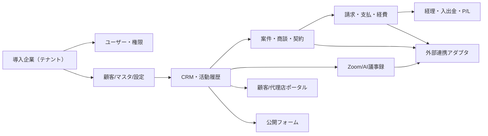
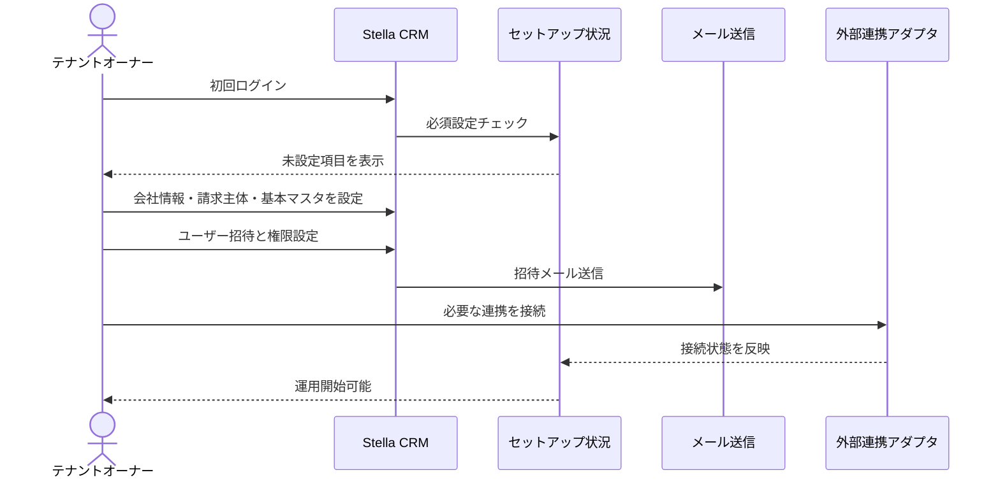
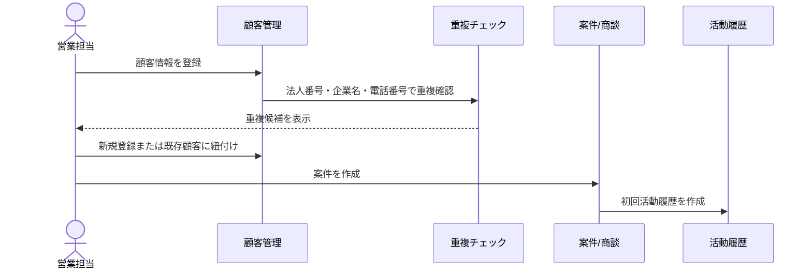
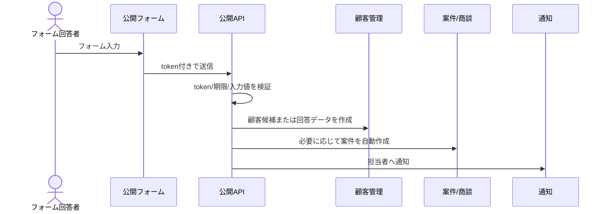
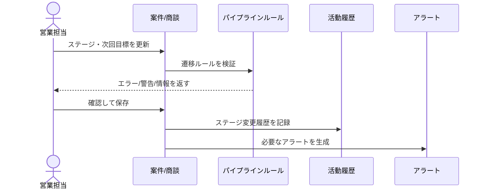
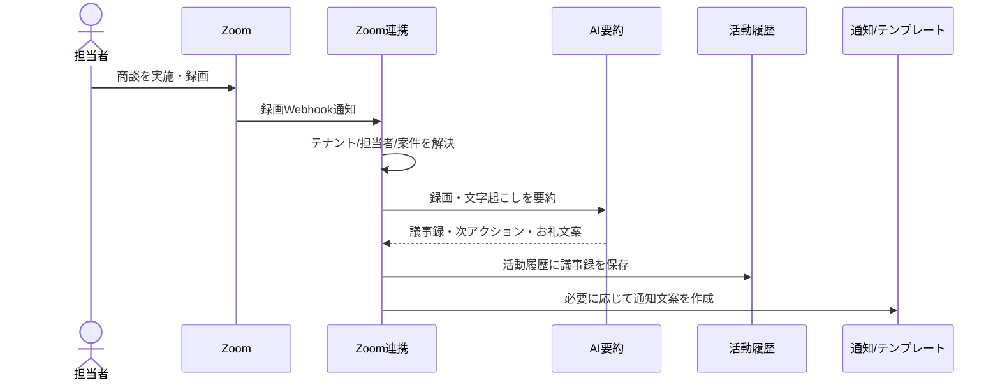
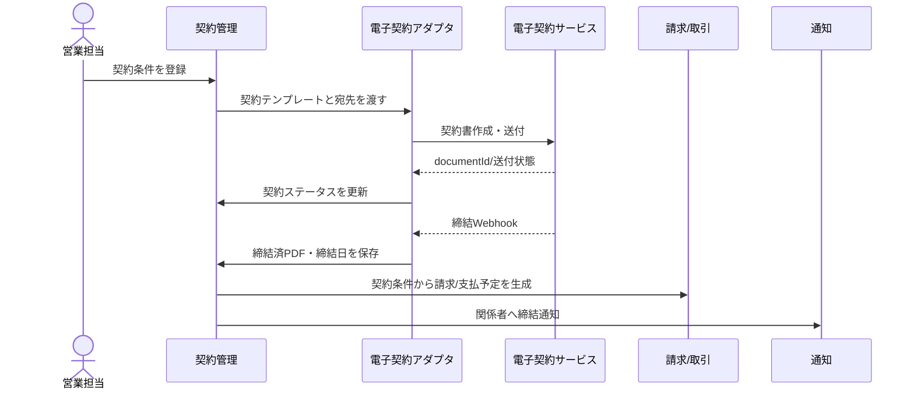
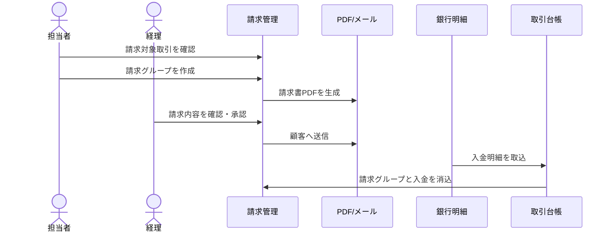
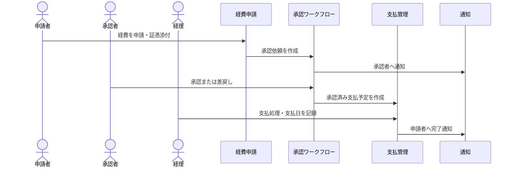
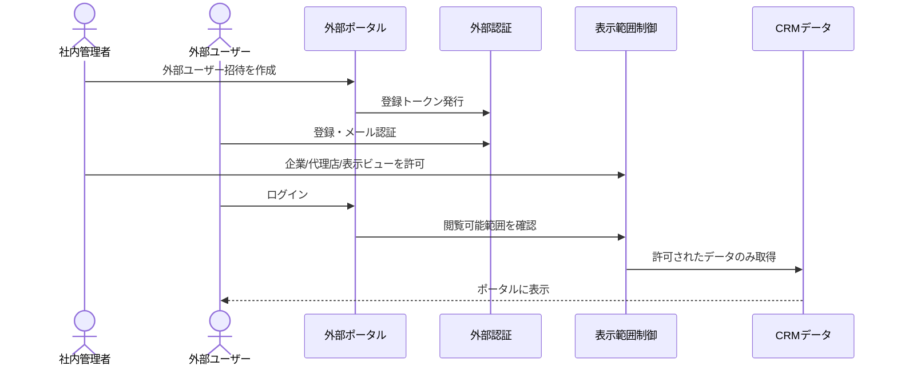

# Stella CRM 外販化 要件定義たたき台

作成日: 2026-05-20

## 1. この資料の目的

Stella CRM を外販可能な業務システムとして再構築するために、現行機能・画面・DB/データ・API・権限・To-Be業務フローを1つにまとめる。

この資料は、要件定義ミーティングで共有するための完成版の入口である。詳細なカラム定義、API入出力、画面カラム、モーダル仕様は、次工程で個別仕様書に分解する。

## 2. 結論サマリー

Stella CRM は、単なるCRMではなく、以下の機能が統合された業務OSである。

| 領域 | 現行の強み | 外販化での扱い |
|------|------------|----------------|
| CRM | 全顧客、企業担当者、接触履歴、ファイル添付 | 初期外販版の中核 |
| 営業管理 | 商談パイプライン、アラート、契約、リードフォーム | 初期外販版の中核 |
| 請求・支払 | 請求書、支払管理、取引台帳、経費申請 | 初期または上位プラン |
| 議事録 | Zoom録画、AI要約、お礼文候補、活動履歴 | 差別化機能として優先度高 |
| 外部ポータル | 顧客ポータル、代理店ポータル、公開フォーム | オプション化 |
| 経理 | 仕訳、P/L、予実、入出金、月次締め | 重めの会計オプション |
| STP | 採用支援向け企業/候補者/KPI/代理店 | 採用支援テンプレート |
| SLP | 組合員、LINE、契約リマインド、資料配布 | 保険/組合系テンプレート |
| HOJO | 補助金、融資、ベンダー、Telegram | 補助金/融資テンプレート |

最初の商品スコープは、**CRM Core + Sales Plus + Billing Basic + Meeting AI** に絞るのが現実的である。

## 3. 現行機能棚卸

| 大分類 | 主な機能 | 主な画面 | 外販化判断 | 再設計メモ |
|--------|----------|----------|------------|------------|
| 認証・権限 | ログイン、招待、パスワード再設定、プロジェクト別権限 | `/login`, `/staff`, `/admin/users` | Core | テナント/モジュール/承認権限に再設計する。 |
| CRMコア | 全顧客、拠点、担当者、銀行口座、接触履歴、ファイル添付 | `/companies`, 各接触履歴画面 | Core | 顧客・活動履歴・添付を共通基盤にする。 |
| STP営業管理 | 企業情報、商談、代理店、求職者、リード回答、KPI | `/stp/companies`, `/stp/agents`, `/stp/candidates` | Core + Industry | 汎用案件管理と採用支援固有項目を分離する。 |
| 契約管理 | 契約書進捗、契約履歴、CloudSign連携 | `/stp/contracts`, `/slp/contracts` | Core + Option | 電子契約はアダプタ化する。 |
| 請求・財務 | 請求、支払、取引台帳、売掛、経費申請 | `/stp/finance/*`, `/accounting/workflow` | Core + Option | 契約から請求/支払予定を生成する流れを一本化する。 |
| 経理 | 仕訳、P/L、予実、入出金、マスタ、月次締め | `/accounting/*` | Optional | 会計ソフトとの責任分界を決める。 |
| SLP | 組合員、事業者、LINE、契約リマインド、Zoom議事録 | `/slp/*`, `/form/slp-*` | Industry | LINE/ProLine依存を連携アダプタへ分離する。 |
| HOJO | 申請者、フォーム回答、融資、ベンダー、Telegram | `/hojo/*`, `/form/hojo-*` | Industry/Custom | 補助金/融資テンプレートと個社固有を分ける。 |
| 公開フォーム | STP/SLP/HOJOの各種フォーム | `/form/*`, `/api/public/*` | Configurable Core | フォーム項目と送信後処理を設定化する。 |
| 外部ポータル | STP顧客/代理店、HOJO外部ポータル | `/portal/stp/*`, `/hojo/bbs`, `/hojo/lender` | Optional | 外部ユーザー基盤へ統合する。 |
| 外部連携 | CloudSign、Zoom、ProLine、Telegram、IMAP、Google | `/api/cloudsign/*`, `/api/webhooks/zoom`, `/api/cron/*` | Option | 連携サービスを差し替えられるアダプタ設計にする。 |

## 4. 画面別棚卸

| 領域 | 画面グループ | 代表URL | 主な利用者 | 主な操作 | 外販化メモ |
|------|--------------|---------|------------|----------|------------|
| 認証 | ログイン/再設定/招待 | `/login`, `/forgot-password`, `/staff/setup/[token]` | 全ユーザー | ログイン、再設定、初期設定 | SSO/MFA、テナント別ログインを検討。 |
| 共通 | ホーム/通知/プロフィール | `/`, `/notifications`, `/profile` | 社内スタッフ | 状況確認、通知、個人設定 | テナントトップと通知センターにする。 |
| CRM | 全顧客マスタ | `/companies`, `/companies/[id]` | 営業、管理者、経理 | 登録、検索、詳細、編集 | 外販コア。重複統合と項目カスタムが必要。 |
| 管理 | スタッフ/外部ユーザー/セットアップ | `/staff`, `/admin/users`, `/admin/setup-status` | 管理者 | 招待、承認、権限、初期設定確認 | テナント管理画面として整理。 |
| 固定データ | 共通/プロジェクトマスタ | `/settings/*`, `/stp/settings/*`, `/slp/settings/*` | 管理者 | 選択肢、テンプレート、連携設定 | システム固定とテナント編集可を分ける。 |
| STP | 営業管理 | `/stp/dashboard`, `/stp/companies`, `/stp/agents`, `/stp/lead-submissions` | STP担当者 | 案件、代理店、リード、商談管理 | 汎用営業管理に再設計。 |
| STP | 活動/契約/KPI | `/stp/contracts`, `/stp/records/*`, `/stp/companies/[id]/kpi` | 営業、運用 | 契約、接触履歴、KPI入力 | 採用支援テンプレートへ切り出し。 |
| 請求 | STP財務 | `/stp/finance/invoices`, `/stp/finance/payment-groups`, `/stp/finance/transactions` | 営業、経理 | 請求、支払、取引確認 | 請求/支払モジュールとして外販候補。 |
| 経理 | 経理業務 | `/accounting/workflow`, `/accounting/journal`, `/accounting/pl`, `/accounting/budget` | 経理 | 承認、仕訳、P/L、予実 | 会計オプション。 |
| SLP | SLP業務 | `/slp/members`, `/slp/companies`, `/slp/line-friends`, `/slp/records/zoom-recordings` | SLP担当者 | 組合員、LINE、契約、議事録 | 保険/組合テンプレート。 |
| HOJO | 補助金/融資業務 | `/hojo/application-support`, `/hojo/loan-progress`, `/hojo/settings/vendors` | HOJO担当者 | 申請、融資、ベンダー管理 | 補助金/融資テンプレート。 |
| 公開 | 公開フォーム | `/form/stp-lead/[token]`, `/form/slp-member`, `/form/hojo-loan-application` | 外部利用者 | フォーム入力、書類提出、予約 | フォームビルダー化する。 |
| 外部 | 顧客/代理店ポータル | `/portal/stp/client`, `/portal/stp/agent` | 顧客、代理店 | 情報閲覧、一部入力 | 顧客/代理店ポータルとしてオプション化。 |

## 5. DB / データ棚卸

| データ群 | 主なテーブル | 日本語名 | 役割 | 外販化メモ |
|----------|--------------|----------|------|------------|
| CRM共通 | `MasterStellaCompany`, `StellaCompanyLocation`, `StellaCompanyContact`, `StellaCompanyBankAccount` | 顧客、拠点、担当者、銀行口座 | 顧客情報の中心 | テナントごとに完全分離する。 |
| 活動履歴 | `ContactHistory`, `SlpContactHistory`, `HojoContactHistory`, 各File/Tag | 接触履歴/活動履歴 | 顧客対応・議事録・添付を記録 | STP/SLP/HOJOの履歴モデルを共通化する。 |
| 認証・権限 | `MasterStaff`, `StaffPermission`, `ExternalUser`, `DisplayView`, `RegistrationToken` | ユーザー/権限/招待 | 社内・外部ユーザーと閲覧範囲を管理 | テナント、モジュール、外部ポータル権限に再設計。 |
| 組織・設定 | `MasterProject`, `OperatingCompany`, `ContractType`, `MasterContractStatus` | プロジェクト、法人、契約種別、ステータス | 業務設定を管理 | プロジェクトとテナントを分離する。 |
| 契約 | `MasterContract`, `MasterContractStatusHistory`, `ContractFile`, `ContractRelation` | 契約書、履歴、ファイル、関連契約 | 契約書ライフサイクルを管理 | 外販コア。電子契約連携はオプション。 |
| STP | `StpCompany`, `StpStage`, `StpAgent`, `StpCandidate`, `StpKpiSheet`, `StpLeadFormSubmission` | 採用支援案件、代理店、候補者、KPI、リード | 採用支援業務を支える | 汎用案件管理と採用支援テンプレートに分離。 |
| 請求/支払 | `Transaction`, `InvoiceGroup`, `PaymentGroup`, `InboundInvoice`, `Attachment` | 取引、請求、支払、受信請求書、添付 | 契約後のお金の流れを管理 | 外販価値が高い。状態遷移を明確化。 |
| 経理 | `Account`, `JournalEntry`, `Counterparty`, `Budget`, `BankStatementEntry`, `MonthlyCloseLog` | 勘定科目、仕訳、取引先、予算、銀行明細、月次締め | 会計処理を管理 | 会計オプション。会計ソフト連携範囲を決める。 |
| SLP | `SlpMember`, `SlpLineFriend`, `SlpCompanyRecord`, `SlpZoomRecording`, `SlpNotificationTemplate` | 組合員、LINE友達、事業者、録画、通知文面 | SLP業務を支える | 業種テンプレート化。ProLine依存を分離。 |
| HOJO | `HojoFormSubmission`, `HojoApplicationSupport`, `HojoLoanProgress`, `HojoVendor`, `HojoTelegram*` | フォーム回答、申請、融資、ベンダー、Telegram | HOJO業務を支える | 補助金/融資テンプレートと個社固有に分ける。 |
| 外部連携/監査 | `StaffMeetingIntegration`, `AutomationError`, `Notification`, `ActivityLog`, `FieldChangeLog` | Zoom連携、エラー、通知、操作ログ、変更履歴 | 運用・監査を支える | 外販コアとして監査/運用画面を整備。 |

## 6. API / Server Action 棚卸

| 種類 | 代表API/ファイル | 役割 | 外販化メモ |
|------|------------------|------|------------|
| 認証API | `/api/auth/[...nextauth]`, `/api/forgot-password`, `/api/reset-password` | ログイン、再設定、セッション管理 | SSO/MFA、失敗回数制限、監査ログを検討。 |
| 招待/外部ユーザーAPI | `/api/registration/*`, `/api/admin/users/*` | 外部ユーザー登録、承認、表示ビュー管理 | 顧客/代理店ポータルの招待基盤にする。 |
| CRM API/Action | `/api/companies/search`, `src/app/companies/actions.ts` | 企業検索、企業登録/編集 | テナントスコープと重複候補を標準化。 |
| ファイルAPI | `/api/comments/upload`, `/api/contracts/upload`, `/api/uploads/[...path]` | 添付ファイル保存/取得 | 共通ファイル基盤、権限、容量、保存先を統一。 |
| 契約API | `/api/cloudsign/*`, `src/app/stp/contracts/actions.ts` | 契約登録、電子契約送付、Webhook同期 | 電子契約アダプタに分離。 |
| 公開フォームAPI | `/api/public/lead-form/*`, `/api/public/slp/*`, `/api/public/hojo/*` | フォーム送信、予約、Webhook受信 | token/secret/署名/レート制限を統一。 |
| STP Action | `src/app/stp/**/actions.ts` | STP企業、代理店、候補者、KPI、リード処理 | 汎用案件管理と採用支援テンプレートに分ける。 |
| 財務Action | `src/app/stp/finance/**/actions.ts`, `src/app/finance/**/actions.ts` | 請求、支払、取引、経費申請 | 外販コア候補。状態遷移と承認を明文化。 |
| 経理Action | `src/app/accounting/**/actions.ts` | 仕訳、P/L、予算、入出金、ワークフロー | 会計オプションとして切り出す。 |
| Zoom API | `/api/integrations/zoom/*`, `/api/webhooks/zoom`, `/api/*/zoom-recordings/*` | OAuth、録画取得、AI要約 | Meeting AIモジュールとして統合。 |
| cron API | `/api/cron/*` | 定期同期、リマインド、受信請求書取込、為替取得 | ジョブ管理、実行履歴、再実行を画面化。 |

## 7. 権限マトリクス

### 現行権限

| 権限概念 | 現行の意味 | 外販化での置き換え |
|----------|------------|--------------------|
| `none` | 対象プロジェクトにアクセス不可 | 権限なし |
| `view` | 閲覧可能 | 閲覧者 |
| `edit` | 編集可能 | 一般担当者 |
| `manager` | 管理者相当 | モジュール管理者 |
| `organizationRole=founder` | 組織ファウンダー | テナントオーナー |
| `loginId=admin` | システム管理者 | 運営スーパー管理者 |
| `canEditMasterData` | 固定データ編集 | テナント設定管理者 |
| `canApprove` | 承認権限 | 承認者 |
| `DisplayView` | 外部ユーザー表示ビュー | 顧客/代理店ポータル権限 |

### 外販版推奨ロール

| ロール | 想定利用者 | 標準権限 |
|--------|------------|----------|
| 運営スーパー管理者 | サービス提供会社 | 全テナント管理、障害対応、初期設定支援 |
| テナントオーナー | 導入企業責任者 | 全モジュール管理、ユーザー管理、契約/請求設定 |
| テナント管理者 | 導入企業管理者 | ユーザー管理、マスタ、モジュール設定 |
| 営業担当 | 導入企業スタッフ | CRM、案件、接触履歴、契約の作成編集 |
| 経理担当 | 導入企業経理 | 請求、支払、経費、入出金、仕訳 |
| 承認者 | 部門長/責任者 | 経費・支払・請求の承認 |
| 閲覧者 | 経営者/監査/外部委託 | ダッシュボード・レポート閲覧 |
| 顧客ユーザー | 導入企業の顧客 | 顧客ポータル閲覧、一部入力 |
| 代理店ユーザー | パートナー | リード登録、案件進捗閲覧 |
| ゲスト | フォーム回答者 | 公開フォーム送信のみ |

## 8. 共通機能・業種別機能の切り分け

| 現行機能 | 分類 | 外販版での扱い |
|----------|------|----------------|
| ログイン、ユーザー招待、権限、通知、監査ログ | Core | 標準搭載 |
| 顧客管理、担当者、拠点、接触履歴、ファイル添付 | Core | CRM Core |
| 案件/商談パイプライン、契約管理、公開フォーム | Core / Configurable Core | Sales Plus |
| 請求管理、経費申請、取引台帳 | Core / Optional | Billing Basic/Plus |
| 支払管理、入出金消込、受信請求書取込 | Optional | Billing Plus |
| 仕訳、P/L、予実、月次締め | Optional | Accounting Plus |
| Zoom連携、AI議事録、お礼文生成 | Configurable Core / Optional | Meeting AI |
| 顧客/代理店ポータル | Optional | Portal Module |
| 代理店管理、報酬計算 | Optional | Partner Module |
| STP候補者、媒体KPI、採用提案書 | Industry Template | Recruiting Template |
| SLP組合員、LINE、契約リマインド、資料配布 | Industry Template | Insurance/Association Template |
| HOJO申請支援、融資進捗、文書生成 | Industry Template | Grant/Loan Template |
| USDT、セキュリティクラウド卸、個社固有ProLine URL | Custom / Internal | 標準外販から除外または個別開発 |

## 9. 推奨商品構成

| モジュール | 含める機能 | 想定顧客 |
|------------|------------|----------|
| CRM Core | 顧客管理、担当者、接触履歴、ファイル、通知、権限、マスタ | 幅広い中小企業 |
| Sales Plus | 案件管理、商談パイプライン、契約管理、外部フォーム | BtoB営業組織 |
| Billing Plus | 請求、支払、経費申請、取引台帳、入出金消込 | 請求/支払業務が重い企業 |
| Meeting AI | Zoom連携、AI議事録、活動履歴連携、お礼文生成 | 商談/面談が多い企業 |
| Customer/Partner Portal | 顧客ポータル、代理店ポータル、外部ユーザー管理 | 顧客/代理店へ情報共有したい企業 |
| Industry Templates | 採用支援、保険/組合、補助金/融資 | 業種特化顧客 |

## 10. To-Be 全体像

## 11. To-Be 業務フロー

### 11.1 テナント初期設定

### 11.2 顧客登録・案件化

### 11.3 公開フォームからのリード獲得

### 11.4 商談パイプライン・活動履歴

### 11.5 Zoom / AI議事録

### 11.6 契約作成・電子契約

### 11.7 請求書発行・入金消込

### 11.8 経費申請・支払承認

### 11.9 顧客/代理店ポータル

## 12. 次に決めること

| 優先 | 論点 | 決める内容 |
|------|------|------------|
| 1 | 初期販売スコープ | CRM Core + Sales Plus + Billing Basic + Meeting AI で開始するか。 |
| 2 | テナント設計 | 導入企業ごとのデータ分離、運営スーパー管理者の扱い。 |
| 3 | 権限モデル | テナント/モジュール/操作/承認/外部ポータルの権限。 |
| 4 | 共通データモデル | 顧客、案件、活動履歴、契約、請求、取引、添付の中心構造。 |
| 5 | 外部連携 | CloudSign、Zoom、ProLine、メール、銀行明細を標準/オプションに分類。 |
| 6 | 業種テンプレート | 採用支援、保険/組合、補助金/融資をどこまで商品化するか。 |

## 13. 詳細化すべき次工程

| 成果物 | 内容 |
|--------|------|
| 画面詳細仕様 | 主要画面ごとの項目、ボタン、検索、権限、状態を定義する。 |
| API詳細仕様 | API/Server Actionごとの入力、出力、認証、副作用、エラーを定義する。 |
| DB概念ER図 | 外販版のテナント、顧客、案件、契約、請求、活動履歴の関係を図示する。 |
| 権限詳細マトリクス | ロール別に画面/操作/API/データ範囲を定義する。 |
| 外部連携仕様 | 電子契約、Zoom、メール、LINE、銀行明細の接続方式と失敗時挙動を定義する。 |
