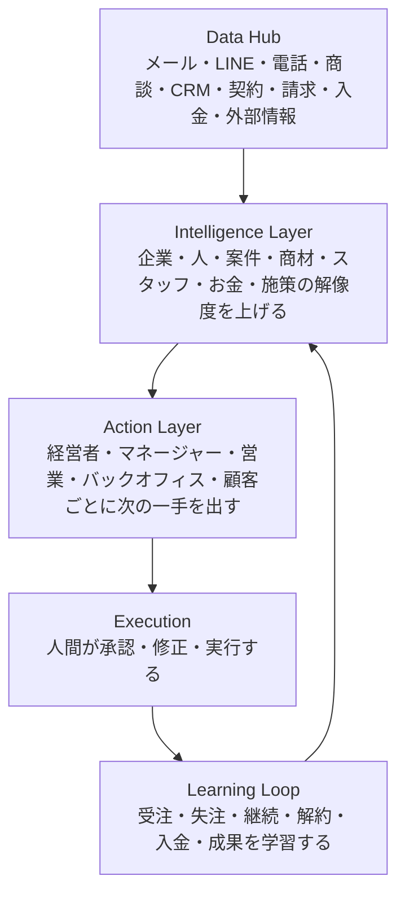

# StellaOS One Page Architecture

## 全体像

StellaOSは、会社の現実をデータとして集め、AIが意味に変え、売上利益が最大化する次の行動を出し、その結果からさらに賢くなるAI経営OSである。

構造は4層で考える。

## 1. Data Hub

すべての情報が集まる層。

- メール
- LINE
- 電話
- Zoom、商談
- フォーム営業
- CRM
- 契約
- 請求
- 入金
- 納品
- タスク
- スタッフ行動
- 外部リサーチ情報
- Web、SNS、求人、ニュース

Data Hubは、会社の現実を映す場所である。

## 2. Intelligence Layer

集まったデータをAIが読み解く層。

AIが解像度を上げる対象は、企業、担当者、案件、商材、スタッフ、お金、施策である。

- この企業には何が刺さるか
- この人はどんな意思決定をするか
- この案件は受注しそうか
- この商材はどの顧客層に強いか
- このスタッフは何が得意か
- この案件は利益が残るか
- この施策は効果が出ているか

Intelligence Layerは、会社の状況を意味に変える場所である。

## 3. Action Layer

AIが理解した情報を、実際の行動に変える層。

経営者には、今月の着地見込み、施策提案、人員配置、事業リスクを出す。

マネージャーには、誰に何を任せるべきか、どの案件が止まりそうか、誰を支援すべきかを出す。

営業には、今日やるべきこと、誰に営業すべきか、何を提案すべきか、どの資料を使うべきかを出す。

バックオフィスには、何を確認すべきか、どの請求を出すべきか、どの書類に不備があるかを出す。

顧客には、早い返信、正確な案内、パーソナライズされた提案、手間の少ない手続きを届ける。

Action Layerは、理解を成果につながる行動に変える場所である。

## 4. Learning Loop

StellaOSの成長エンジン。

AIが提案する。人間が承認、修正する。実行される。結果が出る。その結果をAIが学ぶ。次の提案が良くなる。

学習するものは、営業文の反応、商談結果、提案内容、価格、継続、解約、入金、スタッフ成果、施策効果である。

Learning Loopは、会社の勝ちパターンを蓄積する場所である。

## ハブとしてのStellaOS

StellaOSがすべての機能を内製する必要はない。

リサーチ、電話、メール、LINE、Zoom、請求、会計、資料作成、AIエージェントなどの外部ツールとつながり、それらの情報をStellaOSに集約し、会社の最適行動に変換する。

StellaOSは、外部ツールやAI機能を束ねる司令塔である。
